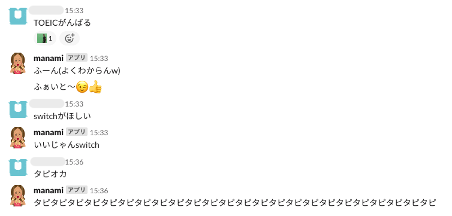

# galpy-slackbot
ギャル風のbotとslack上で会話できます。
## 動作環境
- Python 3.6.0
- Slack (バージョン不明)
- macOS Mojave version 10.14.6
## 使い方(編集中)
- slackbotとPythonの連携については[作成者のGithub](https://github.com/lins05/slackbot)や[解説記事](https://qiita.com/sukesuke/items/1ac92251def87357fdf6)を参考に
- `$ python run.py` を実行
## 会話の様子

## 参考
- [ElIZA in Python](https://github.com/jezhiggins/eliza.py)